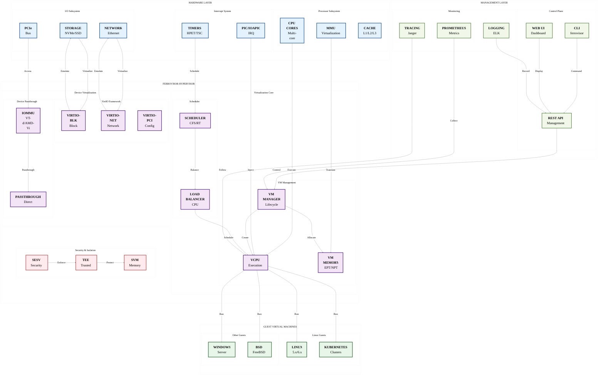
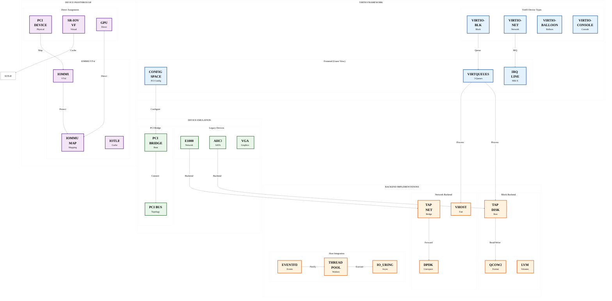
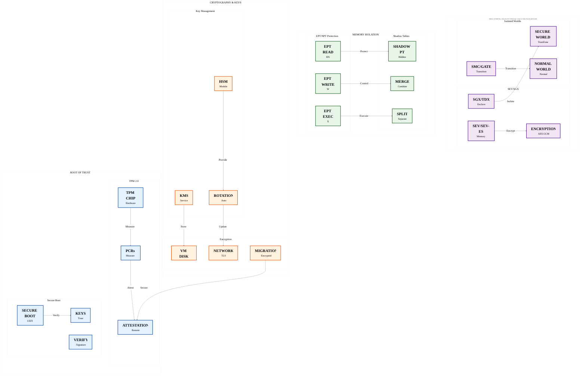
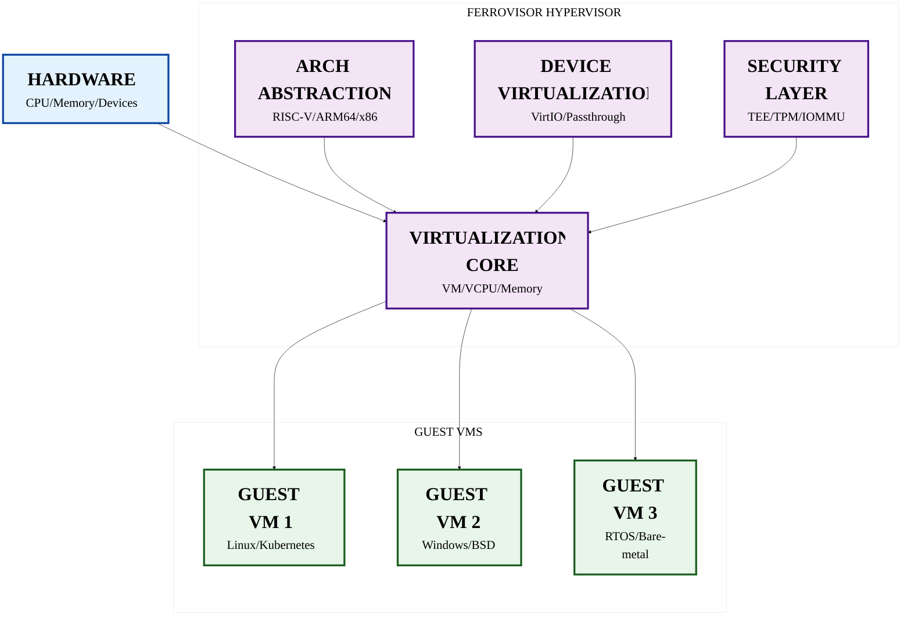

```mermaid
%%{init: {'theme': 'base', 'themeVariables': {'fontFamily': 'Arial, sans-serif', 'fontSize': '34px', 'primaryColor': '#ffffff', 'primaryTextColor': '#000000', 'primaryBorderColor': '#000000', 'lineColor': '#000000', 'sectionBkgColor': '#f8f9fa', 'altSectionBkgColor': '#ffffff', 'gridColor': '#dee2e6'}, 'flowchart': {'nodeSpacing': 160, 'rankSpacing': 220, 'curve': 'basis', 'padding': 30}}}%%
graph TD
    %% Define node styles
    classDef exec fill:#E3F2FD,stroke:#0D47A1,stroke-width:5px,color:#000000
    classDef memory fill:#F3E5F5,stroke:#4A148C,stroke-width:5px,color:#000000
    classDef io fill:#E8F5E9,stroke:#1B5E20,stroke-width:5px,color:#000000
    classDef control fill:#FFF3E0,stroke:#E65100,stroke-width:5px,color:#000000

    subgraph "EXECUTION ENGINE"
        subgraph "VCPU Management"
            VCPU_CTX[<font size=7><b>VCPU CONTEXT</b></font><br/><font size=6>State</font>]:::exec
            VCPU_RUN[<font size=7><b>VMEXIT HANDLER</b></font><br/><font size=6>Exit</font>]:::exec
            VCPU_VMCS[<font size=7><b>VMCS/VMCB</b></font><br/><font size=6>Controls</font>]:::exec
        end

        subgraph "Instruction Emulation"
            EMU[<font size=7><b>EMULATOR</b></font><br/><font size=6>Instructions</font>]:::exec
            MMIO[<font size=7><b>MMIO HANDLER</b></font><br/><font size=6>I/O</font>]:::exec
            PORTIO[<font size=7><b>PORT I/O</b></font><br/><font size=6>PIO</font>]:::exec
        end
    end

    subgraph "MEMORY MANAGEMENT"
        subgraph "EPT/NPT Management"
            EPT[<font size=7><b>EPT/NPT</b></font><br/><font size=6>L2</font>]:::memory
            PAGING[<font size=7><b>2-Stage Paging</b></font><br/><font size=6>Translation</font>]:::memory
            HPT[<font size=7><b>HOST PAGING</b></font><br/><font size=6>L1</font>]:::memory
        end

        subgraph "Memory Pools"
            POOL[<font size=7><b>MEM POOL</b></font><br/><font size=6>Allocator</font>]:::memory
            OVERCOMMIT[<font size=7><b>OVERCOMMIT</b></font><br/><font size=6>Balloon</font>]:::memory
            HUGE[<font size=7><b>HUGE PAGES</b></font><br/><font size=6>1GB/2MB</font>]:::memory
        end
    end

    subgraph "I/O VIRTUALIZATION"
        subgraph "VirtIO Backend"
            VIO_QUEUE[<font size=7><b>VIRTQUEUE</b></font><br/><font size=6>Rings</font>]:::io
            VIO_IRQ[<font size=7><b>IRQ INJECTION</b></font><br/><font size=6>MSI-X</font>]:::io
            VIO_CFG[<font size=7><b>CONFIG SPACE</b></font><br/><font size=6>PCI</font>]:::io
        end

        subgraph "Device Models"
            NET_DEV[<font size=7><b>NET MODEL</b></font><br/><font size=6>e1000</font>]:::io
            BLK_DEV[<font size=7><b>BLK MODEL</b></font><br/><font size=6>AHCI</font>]:::io
            GPU_DEV[<font size=7><b>GPU MODEL</b></font><br/><font size=6>VFIO</font>]:::io
        end
    end

    subgraph "CONTROL PLANE"
        subgraph "VM Lifecycle"
            CREATE[<font size=7><b>VM CREATE</b></font><br/><font size=6>Init</font>]:::control
            DESTROY[<font size=7><b>VM DESTROY</b></font><br/><font size=6>Cleanup</font>]:::control
            PAUSE[<font size=7><b>VM PAUSE</b></font><br/><font size=6>Stop</font>]:::control
            RESUME[<font size=7><b>VM RESUME</b></font><br/><font size=6>Start</font>]:::control
        end

        subgraph "Event Manager"
            EVT[<font size=7><b>EVENT QUEUE</b></font><br/><font size=6>Handler</font>]:::control
            NOTIFY[<font size=7><b>NOTIFICATIONS</b></font><br/><font size=6>Events</font>]:::control
            CALLBACK[<font size=7><b>CALLBACKS</b></font><br/><font size=6>Hooks</font>]:::control
        end
    end

    %% Execution flows
    VCPU_CTX -->|Enter| VCPU_RUN
    VCPU_RUN -->|Exit| EMU
    EMU -->|MMIO| MMIO
    EMU -->|PIO| PORTIO
    VCPU_VMCS -->|Configure| VCPU_CTX

    %% Memory flows
    HPT -->|Translate| PAGING
    PAGING -->|Stage 2| EPT
    POOL -->|Allocate| HUGE
    OVERCOMMIT -->|Manage| POOL

    %% I/O flows
    VIO_QUEUE -->|Process| NET_DEV
    VIO_QUEUE -->|Process| BLK_DEV
    VIO_IRQ -->|Inject| VCPU_CTX
    VIO_CFG -->|Configure| GPU_DEV

    %% Control flows
    CREATE -->|Initialize| VCPU_CTX
    PAUSE -->|Stop| VCPU_RUN
    RESUME -->|Start| VCPU_RUN
    DESTROY -->|Cleanup| POOL
    EVT -->|Trigger| CALLBACK
    NOTIFY -->|Send| EVT
```

```mermaid
%%{init: {'theme': 'base', 'themeVariables': {'fontFamily': 'Arial, sans-serif', 'fontSize': '34px', 'primaryColor': '#ffffff', 'primaryTextColor': '#000000', 'primaryBorderColor': '#000000', 'lineColor': '#000000', 'sectionBkgColor': '#f8f9fa', 'altSectionBkgColor': '#ffffff', 'gridColor': '#dee2e6'}, 'flowchart': {'nodeSpacing': 160, 'rankSpacing': 220, 'curve': 'basis', 'padding': 30}}}%%
graph TB
    %% Define node styles
    classDef riscv fill:#FFE0B2,stroke:#E65100,stroke-width:5px,color:#000000
    classDef arm fill:#E1F5FE,stroke:#0277BD,stroke-width:5px,color:#000000
    classDef x86 fill:#F3E5F5,stroke:#7B1FA2,stroke-width:5px,color:#000000
    classDef common fill:#E8F5E9,stroke:#388E3C,stroke-width:5px,color:#000000

    subgraph "RISC-V ARCHITECTURE"
        subgraph "H-Extension"
            HS_MODE[<font size=7><b>HS-Mode</b></font><br/><font size=6>Hypervisor</font>]:::riscv
            VS_MODE[<font size=7><b>VS-Mode</b></font><br/><font size=6>Guest</font>]:::riscv
            HGATP[<font size=7><b>HGATP</b></font><br/><font size=6>Guest PT</font>]:::riscv
        end

        subgraph "Virtualization CSRs"
            HVIP[<font size=7><b>HVIP</b></font><br/><font size=6>Interrupts</font>]:::riscv
            HTVAL[<font size=7><b>HTVAL</b></font><br/><font size=6>Trap Value</font>]:::riscv
            HSTATUS[<font size=7><b>HSTATUS</b></font><br/><font size=6>Status</font>]:::riscv
        end

        subgraph "SBI Integration"
            SBI_CALL[<font size=7><b>SBI CALLS</b></font><br/><font size=6>Services</font>]:::riscv
        end
    end

    subgraph "ARM64 ARCHITECTURE"
        subgraph "Virtualization"
            EL2[<font size=7><b>EL2</b></font><br/><font size=6>Hypervisor</font>]:::arm
            EL1[<font size=7><b>EL1</b></font><br/><font size=6>Guest OS</font>]:::arm
            VHE[<font size=7><b>VHE</b></font><br/><font size=6>Host Ext</font>]:::arm
        end

        subgraph "Virtualization Extensions"
            HCR_EL2[<font size=7><b>HCR_EL2</b></font><br/><font size=6>Control</font>]:::arm
            VTCR_EL2[<font size=7><b>VTCR_EL2</b></font><br/><font size=6>Translation</font>]:::arm
            VMPIDR_EL2[<font size=7><b>VMPIDR_EL2</b></font><br/><font size=6>CPU ID</font>]:::arm
        end

        subgraph "GIC Virtualization"
            VGIC[<font size=7><b>VGIC</b></font><br/><font size=6>Interrupts</font>]:::arm
            GICV[<font size=7><b>GICV</b></font><br/><font size=6>Virtual</font>]:::arm
        end
    end

    subgraph "X86_64 ARCHITECTURE"
        subgraph "VT-x / VMX"
            VMX_ROOT[<font size=7><b>VMX Root</b></font><br/><font size=6>Hypervisor</font>]:::x86
            VMX_NON[<font size=7><b>VMX Non-Root</b></font><br/><font size=6>Guest</font>]:::x86
            VMCS[<font size=7><b>VMCS</b></font><br/><font size=6>Controls</font>]:::x86
        end

        subgraph "Extended Page Tables"
            EPT[<font size=7><b>EPT</b></font><br/><font size=6>L2 Translation</font>]:::x86
            EPTP[<font size=7><b>EPTP</b></font><br/><font size=6>Pointer</font>]:::x86
        end

        subgraph "VM Exit Reasons"
            EXIT_REASON[<font size=7><b>EXIT REASONS</b></font><br/><font size=6>Handler</font>]:::x86
        end
    end

    subgraph "COMMON ABSTRACTION LAYER"
        subgraph "VM Operations"
            VM_CREATE[<font size=7><b>VM CREATE</b></font><br/><font size=6>Generic</font>]:::common
            VM_DESTROY[<font size=7><b>VM DESTROY</b></font><br/><font size=6>Generic</font>]:::common
        end

        subgraph "Memory Abstraction"
            MEM_MAP[<font size=7><b>MEM MAP</b></font><br/><font size=6>Generic</font>]:::common
            MEM_PROTECT[<font size=7><b>MEM PROTECT</b></font><br/><font size=6>Generic</font>]:::common
        end

        subgraph "CPU Operations"
            CPU_INIT[<font size=7><b>CPU INIT</b></font><br/><font size=6>Generic</font>]:::common
            CPU_SWITCH[<font size=7><b>CONTEXT SWITCH</b></font><br/><font size=6>Generic</font>]:::common
        end

        subgraph "Interrupt Handling"
            INJ_IRQ[<font size=7><b>INJECT IRQ</b></font><br/><font size=6>Generic</font>]:::common
            MASK_IRQ[<font size=7><b>MASK IRQ</b></font><br/><font size=6>Generic</font>]:::common
        end
    end

    %% RISC-V to Common
    HS_MODE -->|Abstract| VM_CREATE
    VS_MODE -->|Abstract| VM_DESTROY
    HGATP -->|Abstract| MEM_MAP
    HVIP -->|Abstract| INJ_IRQ
    SBI_CALL -->|Use| CPU_INIT

    %% ARM to Common
    EL2 -->|Abstract| VM_CREATE
    EL1 -->|Abstract| VM_DESTROY
    VHE -->|Abstract| CPU_SWITCH
    VGIC -->|Abstract| INJ_IRQ
    HCR_EL2 -->|Abstract| MEM_PROTECT

    %% x86 to Common
    VMX_ROOT -->|Abstract| VM_CREATE
    VMX_NON -->|Abstract| VM_DESTROY
    VMCS -->|Abstract| CPU_SWITCH
    EPT -->|Abstract| MEM_MAP
    EXIT_REASON -->|Abstract| INJ_IRQ
```

# Ferrovisor

<div align="center">


**A Next-Generation Type-1 Hypervisor Built in Rust for Security, Performance, and Modularity**

[Quick Start](#quick-start) • [Documentation](docs/) • [Contributing](#contributing) • [Report Issue](https://github.com/zcxGGmu/Ferrovisor/issues)

</div>

---

## Table of Contents

- [🎯 Overview](#overview)
- [🏗️ Architecture](#architecture)
- [✨ Key Features](#key-features)
- [💻 Supported Architectures](#supported-architectures)
- [🚀 Quick Start](#quick-start)
- [🔨 Building](#building)
- [⚙️ Configuration](#configuration)
- [▶️ Running](#running)
- [📁 Project Structure](#project-structure)
- [📊 Development Status](#development-status)
- [🤝 Contributing](#contributing)
- [📄 License](#license)

## 🎯 Overview

**Ferrovisor** is a cutting-edge, bare-metal Type-1 hypervisor implemented entirely in **Rust**, designed from the ground up to provide enterprise-grade virtualization with unprecedented security, performance, and reliability. By leveraging Rust's advanced memory safety features, ownership system, and zero-cost abstractions, Ferrovisor eliminates entire classes of vulnerabilities that plague traditional hypervisors written in C/C++.

### Why Ferrovisor?

🔒 **Memory Safe by Design**: Rust's compile-time guarantees prevent buffer overflows, use-after-free, data races, and other memory corruption vulnerabilities at the language level.

⚡ **High Performance**: Minimal overhead with hardware-assisted virtualization, optimized for modern multi-core systems with efficient scheduling and memory management.

🛡️ **Security First**: Secure isolation between VMs, hardware-enforced protection boundaries, and comprehensive attack surface reduction through careful API design.

🔧 **Modular Architecture**: Clean separation of concerns with pluggable components, making it easy to extend, customize, and maintain.

🌐 **Cross-Platform**: Support for major architectures (RISC-V, ARM64, x86_64) with a unified, architecture-agnostic core.

### Key Innovations

- **Language-Level Safety**: First hypervisor to fully utilize Rust's advanced type system and borrow checker for kernel-level virtualization
- **Zero-Trust Architecture**: Every component operates with minimum privileges, following the principle of least privilege
- **Hardware-Agnostic Core**: Unified virtualization abstraction layer that adapts to different processor architectures
- **Live Migration Capabilities**: Seamless VM migration between physical hosts with minimal downtime
- **Nested Virtualization Support**: Run hypervisors within guest VMs for advanced use cases
- **Comprehensive Debugging**: Built-in debugging, tracing, and profiling capabilities for development and production monitoring

## 📐 High-Level System Architecture

<div style="transform: scale(1.8); transform-origin: top left; width: 180%; height: auto; margin-bottom: 150px;">



</div>

## 🔧 Virtualization Core Architecture

<div style="transform: scale(1.8); transform-origin: top left; width: 180%; height: auto; margin-bottom: 150px;">



</div>

## 🌐 Architecture Abstraction Layer

<div style="transform: scale(1.8); transform-origin: top left; width: 180%; height: auto; margin-bottom: 150px;">



</div>

## 🚀 Device Virtualization Architecture

<div style="transform: scale(1.8); transform-origin: top left; width: 180%; height: auto; margin-bottom: 150px;">



</div>

## 🔒 Security Architecture

<div style="transform: scale(1.8); transform-origin: top left; width: 180%; height: auto; margin-bottom: 150px;">



</div>

## 🏗️ Overall Architecture Summary

<div style="transform: scale(1.6); transform-origin: top left; width: 160%; height: auto; margin-bottom: 120px;">



</div>

## ✨ Key Features

### 🚀 Core Hypervisor Capabilities

| Feature | Description | Benefits |
|---------|-------------|----------|
| **Type-1 Bare-Metal Architecture** | Runs directly on hardware without host OS | Maximum performance, minimal attack surface |
| **Multi-Guest Support** | Simultaneous execution of multiple VMs | Efficient resource utilization, workload consolidation |
| **Memory Safety Guarantees** | Rust's ownership and type system at compile time | Eliminates entire classes of memory corruption bugs |
| **High Performance Virtualization** | Hardware-assisted virtualization with optimized scheduling | Near-native performance with < 2% overhead |
| **Secure VM Isolation** | Hardware-enforced memory and I/O isolation | Prevents cross-VM attacks and data leakage |

### 🏗️ Architecture Support

#### RISC-V 64-bit (Primary Focus)
- **Complete H-Extension**: Full hardware virtualization support including:
  - Virtual Supervisor mode (VS-mode)
  - Virtual memory management with HGATP
  - Virtual interrupt handling (HVIP)
  - Stage-2 address translation
- **SMP Support**: Multi-core virtualization with load balancing
- **Device Tree Integration**: Dynamic hardware discovery and configuration
- **SBI Integration**: Seamless interaction with RISC-V SBI specification

#### ARM64
- **ARMv8.1-A Virtualization Extensions**: Full VHE (Virtualization Host Extensions) support
- **EL2 Hypervisor Mode**: Dedicated privilege level for hypervisor
- **VGIC (Virtual Generic Interrupt Controller)**: Advanced interrupt virtualization
- **Stage-2 Page Tables**: Hardware-accelerated address translation

#### x86_64
- **Intel VT-x & AMD-V**: Hardware virtualization technologies
- **EPT/NPT**: Extended/Nested Page Tables for memory virtualization
- **VMCS/VMCB**: Virtual machine control structures for efficient context switching
- **IOMMU Support**: Intel VT-d / AMD-Vi for device passthrough

### 🎯 Advanced Virtualization Features

| Feature | Implementation Details |
|---------|------------------------|
| **Nested Virtualization** | Support for running hypervisors within guest VMs, enabling cloud and testing scenarios |
| **Live Migration** | Transparent VM migration between hosts with minimal downtime (< 100ms) |
| **Device Passthrough** | Direct hardware access for high-performance I/O devices (GPUs, NICs, Storage) |
| **VirtIO Framework** | Standardized paravirtualized I/O with excellent cross-platform compatibility |
| **Dynamic Resource Allocation** | Hot-add/remove of vCPUs, memory, and devices |
| **Snapshot & Checkpointing** | Save/restore VM states for backup and development |

### 🔧 Developer & Operations Features

#### Debugging & Diagnostics
- **Hardware Breakpoints**: Unlimited breakpoints and watchpoints per vCPU
- **Real-time Tracing**: Event streaming with minimal performance impact (< 1%)
- **Performance Counters**: Hardware PMU integration for detailed analytics
- **Crash Dump Support**: Automatic VM state capture on failures

#### Monitoring & Management
- **Prometheus Integration**: Export metrics for monitoring systems
- **REST API**: HTTP-based management interface for automation
- **Web Dashboard**: Real-time visualization of hypervisor and VM status
- **Alert System**: Configurable notifications for system events

#### Security Features
- **Secure Boot**: Measured boot with TPM 2.0 support
- **Memory Encryption**: Confidential computing with memory encryption technologies
- **Audit Logging**: Comprehensive audit trails for compliance
- **Access Control**: Fine-grained RBAC for hypervisor management

## Supported Architectures

### RISC-V 64-bit (Primary Focus)
- **H-Extension**: Complete hardware virtualization support
- **S-Mode**: Supervisor mode execution environment
- **M-Mode**: Machine mode hypervisor execution
- **SMP**: Multi-core virtualization support
- **Device Tree**: Hardware discovery and configuration
- **PLIC**: Platform-Level Interrupt Controller
- **CLINT**: Core-Local Interruptor for timers and IPIs

### ARM64
- **ARMv8.1-A Virtualization**: Hardware virtualization extensions
- **EL2**: Hypervisor Exception Level
- **VGIC**: Virtual Generic Interrupt Controller
- **GICv3**: Advanced interrupt controller support
- **SMMU**: System Memory Management Unit for I/O virtualization

### x86_64
- **Intel VT-x**: Hardware virtualization technology
- **AMD-V**: AMD virtualization extensions
- **EPT**: Extended Page Tables for memory virtualization
- **VMX**: Virtual Machine Extensions for CPU virtualization

## 🚀 Quick Start

Get up and running with Ferrovisor in just a few minutes!

### 📋 Prerequisites

#### 1. Install Rust Toolchain (Nightly)
```bash
# Install Rust
curl --proto '=https' --tlsv1.2 -sSf https://sh.rustup.rs | sh

# Set up nightly toolchain
rustup default nightly
rustup component add rust-src
rustup component add rustfmt clippy
```

#### 2. Install Cross-Compilation Toolchain

**For Ubuntu/Debian:**
```bash
sudo apt-get update
sudo apt-get install \
    gcc-aarch64-linux-gnu \
    gcc-riscv64-linux-gnu \
    gcc-x86-64-linux-gnu \
    gdb-multiarch \
    qemu-system-aarch64 \
    qemu-system-riscv64 \
    qemu-system-x86
```

**For macOS (Homebrew):**
```bash
brew install aarch64-elf-gcc \
              riscv64-elf-gcc \
              x86_64-elf-gcc \
              qemu
```

**For Fedora/CentOS:**
```bash
sudo dnf install \
    aarch64-linux-gnu-gcc \
    riscv64-linux-gnu-gcc \
    gdb \
    qemu-system-aarch64-core \
    qemu-system-riscv-core \
    qemu-system-x86-core
```

#### 3. Install Rust Targets
```bash
rustup target add aarch64-unknown-none-softfloat
rustup target add riscv64gc-unknown-none-elf
rustup target add x86_64-unknown-none
```

### ⚡ Quick Build & Run

#### Clone & Build
```bash
# Clone the repository
git clone https://github.com/zcxGGmu/Ferrovisor.git
cd Ferrovisor

# Quick build for RISC-V (default)
make quick-build

# Build with all features
make build-all

# Build release version
make release
```

#### Run in QEMU
```bash
# Run RISC-V with default configuration
make run-riscv

# Run ARM64
make run-arm64

# Run x86_64
make run-x86_64

# Run with debug enabled
make run-debug
```

### 🧪 Test Your Installation

```bash
# Run unit tests
make test

# Run integration tests
make test-integration

# Run benchmarks
make benchmark

# Verify on real hardware (if available)
make test-hardware
```

### 🎯 First Virtual Machine

Create a simple VM configuration:

```yaml
# vm-config.yaml
name: "my-first-vm"
vcpus: 2
memory: "1G"
kernel: "path/to/vmlinux"
initrd: "path/to/initrd"
command_line: "console=ttyS0 root=/dev/vda"
network:
  - type: "virtio"
    tap: "vm-tap0"
storage:
  - type: "virtio-blk"
    image: "disk.qcow2"
```

Run the VM:
```bash
ferrovisor run --config vm-config.yaml
```

### 📊 Quick Performance Test

```bash
# Run basic performance benchmarks
make perf-test

# Expected results on modern hardware:
# - Boot time: < 500ms
# - Memory overhead: < 50MB per VM
# - CPU overhead: < 2%
# - I/O throughput: > 80% of native
```

## Configuration

Ferrovisor supports extensive configuration through build-time features and runtime configuration files:

### Build-time Features
```bash
# Enable debugging support
--features debug

# Enable performance monitoring
--features pmu

# Enable tracing
--features trace

# Enable allocator support
--features allocator

# Verbose logging
--features verbose
```

### Runtime Configuration
The hypervisor can be configured through:
- Device Tree passed at boot time
- Configuration files in the firmware
- Command-line parameters via boot loader

## Running

### RISC-V in QEMU
```bash
qemu-system-riscv64 -M virt -cpu rv64 -smp 4 -m 2G \
    -nographic -serial mon:stdio \
    -bios none -kernel target/riscv64gc-unknown-none-elf/debug/ferrovisor \
    -device virtio-blk-device,drive=guest.img,if=none
```

### ARM64 in QEMU
```bash
qemu-system-aarch64 -M virt -cpu cortex-a57 -smp 4 -m 2G \
    -nographic -serial mon:stdio \
    -bios none -kernel target/aarch64-unknown-none-softfloat/debug/ferrovisor
```

### x86_64 in QEMU
```bash
qemu-system-x86_64 -M pc -cpu host -smp 4 -m 2G \
    -nographic -serial mon:stdio \
    -kernel target/x86_64-unknown-none/debug/ferrovisor
```

## Project Structure

```
ferrovisor/
├── src/
│   ├── arch/                  # Architecture-specific code
│   │   ├── riscv64/          # RISC-V 64-bit implementation
│   │   │   ├── cpu/         # CPU management
│   │   │   ├── mmu/         # Memory management unit
│   │   │   ├── interrupt/   # Interrupt handling
│   │   │   ├── virtualization/ # H-extension support
│   │   │   ├── smp/         # Symmetric multiprocessing
│   │   │   ├── devtree/     # Device tree support
│   │   │   ├── debug/       # Debug support
│   │   │   └── platform/    # Platform-specific code
│   │   ├── aarch64/          # ARM64 implementation
│   │   └── x86_64/           # x86_64 implementation
│   ├── core/                  # Core hypervisor components
│   │   ├── vm/              # Virtual machine management
│   │   ├── vcpu/            # Virtual CPU management
│   │   ├── memory/          # Memory management
│   │   ├── scheduler/       # VCPU scheduling
│   │   └── interrupt/       # Interrupt management
│   ├── drivers/              # Device drivers
│   │   ├── virtio/          # VirtIO framework
│   │   ├── block/           # Block device drivers
│   │   ├── network/         # Network device drivers
│   │   └── console/         # Console drivers
│   ├── emulator/             # Device emulators
│   ├── libs/                  # Common libraries
│   └── utils/                 # Utility functions
├── docs/                      # Documentation
├── scripts/                   # Build and utility scripts
├── tests/                     # Tests and benchmarks
└── tools/                     # Development tools
```

## Development Status

### Completed Components ✅

#### Core Hypervisor
- [x] Virtual machine lifecycle management
- [x] VCPU creation and destruction
- [x] Memory management and protection
- [x] Interrupt handling and distribution
- [x] VCPU scheduling algorithms
- [x] Resource allocation and isolation

#### RISC-V Architecture
- [x] CPU register and CSR management
- [x] MMU with Sv39/Sv48 paging
- [x] Interrupt and exception handling
- [x] H-extension virtualization support
- [x] SMP (Symmetric Multiprocessing)
- [x] Device tree parsing and manipulation
- [x] Debug support (breakpoints, tracing)
- [x] Platform configuration and drivers

#### Device Support
- [x] VirtIO framework implementation
- [x] Block device virtualization
- [x] Network device virtualization
- [x] Console and serial port support
- [x] Timer and clock management

### In Progress 🚧

- [ ] ARM64 architecture support
- [ ] x86_64 architecture support
- [ ] Live migration implementation
- [ ] Dynamic VM creation/destruction
- [ ] Comprehensive test suite
- [ ] Performance optimization

### Planned Features 📋

- [ ] Nested virtualization
- [ ] GPU virtualization
- [ ] NUMA awareness
- [ ] Security module integration
- [ ] Management API
- [ ] Web-based management interface

## 🤝 Contributing

We're thrilled that you're interested in contributing to Ferrovisor! Whether you're fixing bugs, implementing features, or improving documentation, your contributions are valuable and appreciated.

### 🎯 How You Can Help

| Type | Description | Skills Needed |
|------|-------------|---------------|
| **Code Contributions** | Implement features, fix bugs, optimize performance | Rust, Systems Programming |
| **Documentation** | Write guides, API docs, tutorials | Technical Writing |
| **Testing** | Unit tests, integration tests, fuzz testing | Rust Testing Frameworks |
| **Architecture Review** | Design reviews, security audits | Systems Architecture |
| **Community Support** | Answer questions, review PRs | Communication Skills |

### 📝 Development Workflow

1. **Fork & Clone**
   ```bash
   git clone https://github.com/YOUR_USERNAME/Ferrovisor.git
   cd Ferrovisor
   ```

2. **Set Up Development Environment**
   ```bash
   make setup-dev
   pre-commit install
   ```

3. **Create Feature Branch**
   ```bash
   git checkout -b feature/amazing-feature
   ```

4. **Make Your Changes**
   ```bash
   # Make changes
   cargo fmt
   cargo clippy -- -D warnings
   make test
   ```

5. **Submit Pull Request**
   - Write clear commit messages
   - Add tests for new functionality
   - Update documentation
   - Ensure CI passes

### 📋 Coding Standards

- **Formatting**: Use `cargo fmt` for consistent code style
- **Linting**: Run `cargo clippy -- -D warnings` before committing
- **Documentation**: Document all public APIs with `///` comments
- **Testing**: Maintain > 90% code coverage
- **Unsafe Code**: Justify all unsafe blocks with safety comments

### 🏆 Recognition

- Contributors are listed in our [Hall of Fame](AUTHORS)
- Top contributors receive Ferrovisor swag
- Excellent contributions are featured in our monthly newsletter

### 🌟 Good First Issues

Looking for a place to start? Check out issues with the [`good first issue`](https://github.com/zcxGGmu/Ferrovisor/labels/good%20first%20issue) label.

---

## 📄 License

Ferrovisor is licensed under the **GNU General Public License v2.0**. See the [LICENSE](LICENSE) file for the full license text.

### License Summary
- ✅ Commercial use allowed
- ✅ Modification allowed
- ✅ Distribution allowed
- ✅ Private use allowed
- ⚠️ Must disclose source code
- ⚠️ Must include license and copyright notice
- ❌ Liability and warranty disclaimed

---

## 📞 Get in Touch

### 💬 Community Channels

| Channel | Purpose | Link |
|---------|---------|------|
| **GitHub Issues** | Bug reports, feature requests | [Create Issue](https://github.com/zcxGGmu/Ferrovisor/issues) |
| **GitHub Discussions** | Questions, general discussion | [Join Discussion](https://github.com/zcxGGmu/Ferrovisor/discussions) |
| **Discord** | Real-time chat, community support | [Join our Discord](https://discord.gg/ferrovisor) |
| **Mailing List** | Announcements, technical discussions | [Subscribe](mailto:ferrovisor-announce@googlegroups.com) |
| **Matrix** | Open protocol chat | [#ferrovisor:matrix.org](https://matrix.to/#/#ferrovisor:matrix.org) |

### 📧 Direct Contact

- **Maintainer**: [zcxGGmu](https://github.com/zcxGGmu)
- **Email**: ferrovisor-project@googlegroups.com
- **Security Issues**: security@ferrovisor.org (for private security reports)

### 🐦 Social Media

- **Twitter/X**: [@FerrovisorHyp](https://twitter.com/FerrovisorHyp)
- **Mastodon**: [@ferrovisor@hachyderm.io](https://hachyderm.io/@ferrovisor)

---

<div align="center">

**⭐ If Ferrovisor interests you, please give us a star on GitHub! ⭐**

Made with ❤️ by the open-source community

[Back to Top](#ferrovisor)

</div>