# Ferrovisor

A next-generation Type-1 Hypervisor written in Rust, designed for security, performance, and modularity.

## Table of Contents

- [Overview](#overview)
- [Architecture](#architecture)
- [Key Features](#key-features)
- [Supported Architectures](#supported-architectures)
- [Quick Start](#quick-start)
- [Building](#building)
- [Configuration](#configuration)
- [Running](#running)
- [Project Structure](#project-structure)
- [Development Status](#development-status)
- [Contributing](#contributing)
- [License](#license)

## Overview

Ferrovisor is a modern Type-1 hypervisor implemented in Rust that runs directly on hardware, providing virtualization capabilities with a focus on memory safety, security, and performance. The project leverages Rust's ownership system and type safety to eliminate entire classes of vulnerabilities common in traditional hypervisors written in C.

## Architecture

```mermaid
%%{init: {'theme': 'base', 'themeVariables': {'fontFamily': 'Arial, sans-serif', 'fontSize': '24px', 'primaryColor': '#fff', 'primaryTextColor': '#000', 'primaryBorderColor': '#666', 'lineColor': '#666', 'sectionBkgColor': '#f5f5f5', 'altSectionBkgColor': '#fff', 'gridColor': '#ddd'}, 'flowchart': {'nodeSpacing': 100, 'rankSpacing': 150, 'curve': 'basis', 'padding': 20}}}%%
graph TD
    %% Define enhanced node styles
    classDef hardware fill:#E3F2FD,stroke:#1565C0,stroke-width:4px,color:#000000
    classDef hypervisor fill:#F3E5F5,stroke:#7B1FA2,stroke-width:4px,color:#000000
    classDef guest fill:#E8F5E9,stroke:#388E3C,stroke-width:4px,color:#000000
    classDef component fill:#FFF3E0,stroke:#F57C00,stroke-width:3px,color:#000000

    subgraph "🖥️ 硬件层 Hardware Layer"
        CPU[<font size="5"><b>CPU 多核处理器</b></font><br/><font size="4">CPU Cores</font>]:::hardware
        MMU[<font size="5"><b>内存管理单元</b></font><br/><font size="4">Memory Management Unit</font>]:::hardware
        Devices[<font size="5"><b>物理设备</b></font><br/><font size="4">Physical Devices</font>]:::hardware
    end

    subgraph "⚙️ Ferrovisor 虚拟化层"
        subgraph "📋 核心组件 Core Components"
            VMM[<font size="5"><b>虚拟机管理器</b></font><br/><font size="4">Virtual Machine Manager</font>]:::component
            Scheduler[<font size="5"><b>VCPU调度器</b></font><br/><font size="4">VCPU Scheduler</font>]:::component
            MemoryMgr[<font size="5"><b>内存管理器</b></font><br/><font size="4">Memory Manager</font>]:::component
        end

        subgraph "🏗️ 架构抽象层 Architecture Abstraction"
            Arch["<font size="5"><b>架构支持层</b></font><br/><font size="4">ARM64 | RISC-V | x86_64</font>"]:::component
        end

        subgraph "🔌 设备管理 Device Management"
            Drivers[<font size="5"><b>设备驱动</b></font><br/><font size="4">Device Drivers</font>]:::component
            Emulators[<font size="5"><b>设备模拟器</b></font><br/><font size="4">Device Emulators</font>]:::component
            VirtIO[<font size="5"><b>VirtIO框架</b></font><br/><font size="4">VirtIO Framework</font>]:::component
        end

        subgraph "🔄 虚拟化支持 Virtualization Support"
            HExt[<font size="5"><b>H扩展支持</b></font><br/><font size="4">H-Extension Support</font>]:::component
            TwoStage[<font size="5"><b>两级地址转换</b></font><br/><font size="4">Two-Stage Translation</font>]:::component
            TrapHandler[<font size="5"><b>陷阱处理器</b></font><br/><font size="4">Trap Handler</font>]:::component
        end

        subgraph "🐛 调试与监控 Debug & Monitoring"
            Debug[<font size="5"><b>调试支持</b></font><br/><font size="4">Debug Support</font>]:::component
            Tracer[<font size="5"><b>事件追踪器</b></font><br/><font size="4">Event Tracer</font>]:::component
            Profiler[<font size="5"><b>性能分析器</b></font><br/><font size="4">Performance Profiler</font>]:::component
        end
    end

    subgraph "💻 虚拟机层 Guest VMs"
        VM1["<font size="5"><b>虚拟机 1</b></font><br/><font size="4">Linux 操作系统</font>"]:::guest
        VM2["<font size="5"><b>虚拟机 2</b></font><br/><font size="4">RTOS 实时系统</font>"]:::guest
        VM3["<font size="5"><b>虚拟机 3</b></font><br/><font size="4">裸机系统</font>"]:::guest
    end

    %% Enhanced connections with larger labels
    CPU -.->|<font size="4">硬件控制</font>| VMM
    MMU -.->|<font size="4">内存管理</font>| MemoryMgr
    Devices -.->|<font size="4">设备访问</font>| Drivers

    VMM -->|<font size="4">管理</font>| VM1
    VMM -->|<font size="4">管理</font>| VM2
    VMM -->|<font size="4">管理</font>| VM3

    Arch -->|<font size="4">抽象层</font>| VMM
    Arch -->|<font size="4">支持</font>| HExt
    Arch -->|<font size="4">支持</font>| TwoStage

    Drivers -->|<font size="4">驱动</font>| Emulators
    Drivers -->|<font size="4">标准</font>| VirtIO

    MemoryMgr -->|<font size="4">虚拟化</font>| TwoStage
    VMM -->|<font size="4">调度</font>| Scheduler
    Scheduler -->|<font size="4">分配</font>| VM1
    Scheduler -->|<font size="4">分配</font>| VM2
    Scheduler -->|<font size="4">分配</font>| VM3

    TrapHandler -->|<font size="4">处理</font>| HExt
    Debug -->|<font size="4">调试</font>| VMM
    Tracer -->|<font size="4">追踪</font>| VMM
    Profiler -->|<font size="4">监控</font>| Scheduler
```

<div style="font-size: 24px; line-height: 1.6;">



</div>

## Key Features

### Core Hypervisor Capabilities
- **Type-1 Architecture**: Bare-metal hypervisor running directly on hardware
- **Multi-Guest Support**: Run multiple virtual machines simultaneously
- **Memory Safety**: Rust's ownership system prevents memory corruption vulnerabilities
- **High Performance**: Minimal overhead virtualization with hardware acceleration
- **Secure Isolation**: Strong isolation between guest VMs and the hypervisor

### Architecture Support
- **ARM64**: Full support for ARM virtualization extensions (ARMv8.1-A)
- **RISC-V 64-bit**: Complete H-extension implementation for hardware virtualization
- **x86_64**: Intel VT-x and AMD-V virtualization support

### Advanced Features
- **Hardware-Assisted Virtualization**: Leverages processor virtualization extensions
- **Nested Virtualization**: Support for running hypervisors within guest VMs
- **Live Migration**: Move running VMs between physical hosts
- **Device Passthrough**: Direct access to physical devices for guest VMs
- **VirtIO Support**: Standardized virtual I/O framework

### Developer Features
- **Comprehensive Debugging**: Hardware breakpoints, watchpoints, and tracing
- **Event Tracing**: Detailed system and VM event collection
- **Performance Profiling**: Built-in profiling and monitoring tools
- **Device Tree Support**: Dynamic hardware discovery and configuration

## Supported Architectures

### RISC-V 64-bit (Primary Focus)
- **H-Extension**: Complete hardware virtualization support
- **S-Mode**: Supervisor mode execution environment
- **M-Mode**: Machine mode hypervisor execution
- **SMP**: Multi-core virtualization support
- **Device Tree**: Hardware discovery and configuration
- **PLIC**: Platform-Level Interrupt Controller
- **CLINT**: Core-Local Interruptor for timers and IPIs

### ARM64
- **ARMv8.1-A Virtualization**: Hardware virtualization extensions
- **EL2**: Hypervisor Exception Level
- **VGIC**: Virtual Generic Interrupt Controller
- **GICv3**: Advanced interrupt controller support
- **SMMU**: System Memory Management Unit for I/O virtualization

### x86_64
- **Intel VT-x**: Hardware virtualization technology
- **AMD-V**: AMD virtualization extensions
- **EPT**: Extended Page Tables for memory virtualization
- **VMX**: Virtual Machine Extensions for CPU virtualization

## Quick Start

### Prerequisites

1. **Rust Toolchain** (nightly required):
```bash
curl --proto '=https' --tlsv1.2 -sSf https://sh.rustup.rs | sh
rustup default nightly
rustup component add rust-src
```

2. **Cross-compilers** for target architectures:
```bash
# Ubuntu/Debian
sudo apt-get update
sudo apt-get install gcc-aarch64-linux-gnu gcc-riscv64-linux-gnu gcc-x86-64-linux-gnu

# macOS (with Homebrew)
brew install aarch64-elf-gcc riscv64-elf-gcc x86_64-elf-gcc
```

3. **Rust Targets**:
```bash
rustup target add aarch64-unknown-none-softfloat
rustup target add riscv64gc-unknown-none-elf
rustup target add x86_64-unknown-none
```

4. **QEMU** (for testing):
```bash
# Ubuntu/Debian
sudo apt-get install qemu-system-aarch64 qemu-system-riscv64 qemu-system-x86

# macOS
brew install qemu
```

### Building

```bash
# Clone the repository
git clone https://github.com/yourusername/ferrovisor.git
cd ferrovisor

# Build for RISC-V 64-bit (primary target)
make TARGET=riscv64gc-unknown-none-elf

# Build for ARM64
make TARGET=aarch64-unknown-none-softfloat

# Build for x86_64
make TARGET=x86_64-unknown-none

# Build with debug features
make FEATURES="--features debug,verbose"

# Build release version
make release
```

## Configuration

Ferrovisor supports extensive configuration through build-time features and runtime configuration files:

### Build-time Features
```bash
# Enable debugging support
--features debug

# Enable performance monitoring
--features pmu

# Enable tracing
--features trace

# Enable allocator support
--features allocator

# Verbose logging
--features verbose
```

### Runtime Configuration
The hypervisor can be configured through:
- Device Tree passed at boot time
- Configuration files in the firmware
- Command-line parameters via boot loader

## Running

### RISC-V in QEMU
```bash
qemu-system-riscv64 -M virt -cpu rv64 -smp 4 -m 2G \
    -nographic -serial mon:stdio \
    -bios none -kernel target/riscv64gc-unknown-none-elf/debug/ferrovisor \
    -device virtio-blk-device,drive=guest.img,if=none
```

### ARM64 in QEMU
```bash
qemu-system-aarch64 -M virt -cpu cortex-a57 -smp 4 -m 2G \
    -nographic -serial mon:stdio \
    -bios none -kernel target/aarch64-unknown-none-softfloat/debug/ferrovisor
```

### x86_64 in QEMU
```bash
qemu-system-x86_64 -M pc -cpu host -smp 4 -m 2G \
    -nographic -serial mon:stdio \
    -kernel target/x86_64-unknown-none/debug/ferrovisor
```

## Project Structure

```
ferrovisor/
├── src/
│   ├── arch/                  # Architecture-specific code
│   │   ├── riscv64/          # RISC-V 64-bit implementation
│   │   │   ├── cpu/         # CPU management
│   │   │   ├── mmu/         # Memory management unit
│   │   │   ├── interrupt/   # Interrupt handling
│   │   │   ├── virtualization/ # H-extension support
│   │   │   ├── smp/         # Symmetric multiprocessing
│   │   │   ├── devtree/     # Device tree support
│   │   │   ├── debug/       # Debug support
│   │   │   └── platform/    # Platform-specific code
│   │   ├── aarch64/          # ARM64 implementation
│   │   └── x86_64/           # x86_64 implementation
│   ├── core/                  # Core hypervisor components
│   │   ├── vm/              # Virtual machine management
│   │   ├── vcpu/            # Virtual CPU management
│   │   ├── memory/          # Memory management
│   │   ├── scheduler/       # VCPU scheduling
│   │   └── interrupt/       # Interrupt management
│   ├── drivers/              # Device drivers
│   │   ├── virtio/          # VirtIO framework
│   │   ├── block/           # Block device drivers
│   │   ├── network/         # Network device drivers
│   │   └── console/         # Console drivers
│   ├── emulator/             # Device emulators
│   ├── libs/                  # Common libraries
│   └── utils/                 # Utility functions
├── docs/                      # Documentation
├── scripts/                   # Build and utility scripts
├── tests/                     # Tests and benchmarks
└── tools/                     # Development tools
```

## Development Status

### Completed Components ✅

#### Core Hypervisor
- [x] Virtual machine lifecycle management
- [x] VCPU creation and destruction
- [x] Memory management and protection
- [x] Interrupt handling and distribution
- [x] VCPU scheduling algorithms
- [x] Resource allocation and isolation

#### RISC-V Architecture
- [x] CPU register and CSR management
- [x] MMU with Sv39/Sv48 paging
- [x] Interrupt and exception handling
- [x] H-extension virtualization support
- [x] SMP (Symmetric Multiprocessing)
- [x] Device tree parsing and manipulation
- [x] Debug support (breakpoints, tracing)
- [x] Platform configuration and drivers

#### Device Support
- [x] VirtIO framework implementation
- [x] Block device virtualization
- [x] Network device virtualization
- [x] Console and serial port support
- [x] Timer and clock management

### In Progress 🚧

- [ ] ARM64 architecture support
- [ ] x86_64 architecture support
- [ ] Live migration implementation
- [ ] Dynamic VM creation/destruction
- [ ] Comprehensive test suite
- [ ] Performance optimization

### Planned Features 📋

- [ ] Nested virtualization
- [ ] GPU virtualization
- [ ] NUMA awareness
- [ ] Security module integration
- [ ] Management API
- [ ] Web-based management interface

## Contributing

We welcome contributions from the community! Here's how you can help:

### Ways to Contribute
1. **Code Contributions**: Implement new features or fix bugs
2. **Documentation**: Improve documentation and write tutorials
3. **Testing**: Write tests and report bugs
4. **Performance**: Optimize critical paths
5. **Architecture**: Design new components and improvements

### Development Workflow
1. Fork the repository
2. Create a feature branch: `git checkout -b feature-name`
3. Make your changes with proper commits
4. Add tests for new functionality
5. Ensure all tests pass: `make test`
6. Submit a pull request with a clear description

### Code Style
- Follow Rust's standard formatting: `cargo fmt`
- Use clippy for linting: `cargo clippy -- -D warnings`
- Document public APIs with rustdoc comments
- Write unit tests for all modules

## License

This project is licensed under the GNU General Public License v2.0. See the [LICENSE](LICENSE) file for details.

## Contact

- **Issues**: Report bugs and feature requests on [GitHub Issues](https://github.com/yourusername/ferrovisor/issues)
- **Discussions**: Use [GitHub Discussions](https://github.com/yourusername/ferrovisor/discussions) for questions
- **Email**: ferrovisor@example.com

---

**Note**: Ferrovisor is actively being developed. While the RISC-V implementation is largely complete, some features are still in progress. Check the development status above for current capabilities.