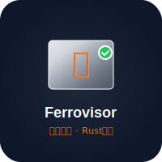
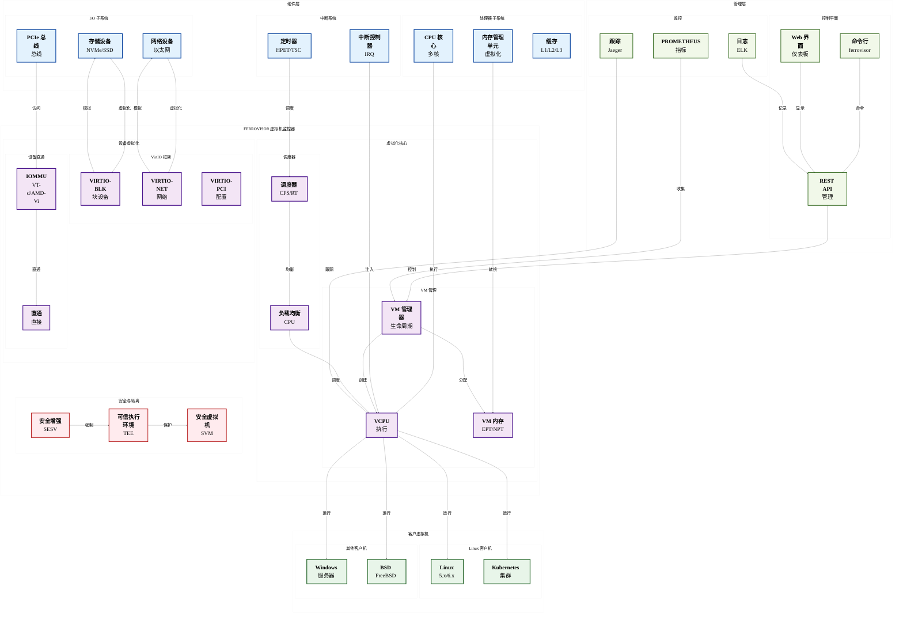
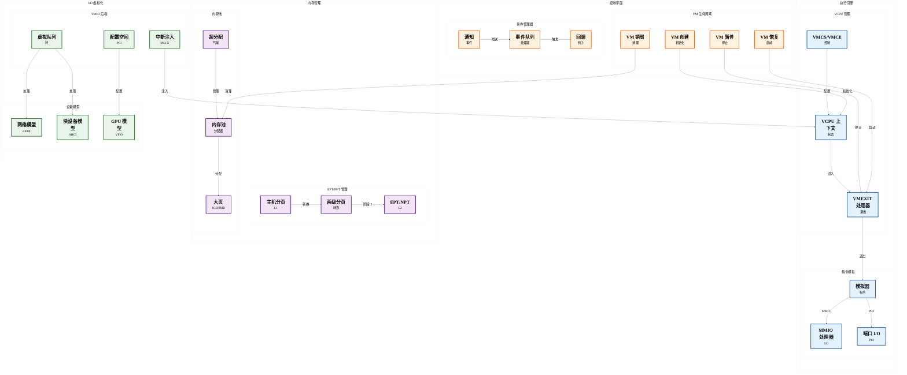

# Ferrovisor

<div align="center">

<p align="center">
  
</p>

<a href="README.md">
  
</a>


**基于 Rust 构建的新一代 Type-1 虚拟机监控器，专注于安全、性能和模块化**

[English](README.md) • [文档](docs/) • [贡献指南](#贡献指南) • [报告问题](https://github.com/zcxGGmu/Ferrovisor/issues)

</div>

---

## 目录

- [🎯 项目概述](#项目概述)
- [🏗️ 系统架构](#系统架构)
- [✨ 核心特性](#核心特性)
- [💻 支持的架构](#支持的架构)
- [🚀 快速开始](#快速开始)
- [🔨 构建指南](#构建指南)
- [⚙️ 配置说明](#配置说明)
- [▶️ 运行指南](#运行指南)
- [📁 项目结构](#项目结构)
- [📊 开发状态](#开发状态)
- [🤝 贡献指南](#贡献指南)
- [📄 许可证](#许可证)

## 🎯 项目概述

**Ferrovisor** 是一个前沿的裸机 Type-1 虚拟机监控器，完全使用 **Rust** 语言实现，旨在提供企业级的虚拟化能力，同时实现前所未有的安全性、性能和可靠性。通过利用 Rust 的高级内存安全特性、所有权系统和零成本抽象，Ferrovisor 消除了传统 C/C++ 虚拟机监控器中整类的漏洞。

### 为什么选择 Ferrovisor？

🔒 **内存安全设计**：Rust 的编译时保证可以在语言层面防止缓冲区溢出、释放后使用、数据竞争等内存损坏漏洞。

⚡ **高性能**：最小化开销的硬件辅助虚拟化，针对现代多核系统优化，具有高效的调度和内存管理。

🛡️ **安全优先**：VM 之间的安全隔离，硬件强制的保护边界，通过精心的 API 设计全面减少攻击面。

🔧 **模块化架构**：清晰的关注点分离和可插拔组件，易于扩展、定制和维护。

🌐 **跨平台**：支持主要架构（RISC-V、ARM64、x86_64），具有统一的架构无关核心。

### 核心创新

- **语言级安全性**：首个充分利用 Rust 高级类型系统和借用检查器进行内核级虚拟化的监控器
- **零信任架构**：每个组件都在最小权限下运行，遵循最小权限原则
- **硬件无关核心**：适应不同处理器架构的统一虚拟化抽象层
- **实时迁移能力**：在物理主机之间无缝迁移 VM，停机时间最短
- **嵌套虚拟化支持**：在客户 VM 中运行虚拟机监控器，用于高级用例
- **全面调试**：内置开发调试、跟踪和性能分析功能

## 📐 高层系统架构

<div style="transform: scale(1.8); transform-origin: top left; width: 180%; height: auto; margin-bottom: 150px;">



</div>

## 🔧 虚拟化核心架构

<div style="transform: scale(1.8); transform-origin: top left; width: 180%; height: auto; margin-bottom: 150px;">



</div>

## ✨ 核心特性

### 🚀 虚拟机监控器核心能力

| 特性 | 描述 | 优势 |
|---------|-------------|----------|
| **Type-1 裸机架构** | 直接在硬件上运行，无需主机操作系统 | 最大性能，最小攻击面 |
| **多客户机支持** | 同时执行多个虚拟机 | 高效资源利用，工作负载整合 |
| **内存安全保证** | Rust 的所有权和类型系统的编译时保证 | 消除整类内存损坏错误 |
| **高性能虚拟化** | 硬件辅助虚拟化与优化调度 | 近原生性能，开销 < 2% |
| **安全 VM 隔离** | 硬件强制的内存和 I/O 隔离 | 防止跨 VM 攻击和数据泄露 |

### 🏗️ 架构支持

#### RISC-V 64位（主要重点）
- **完整的 H-Extension**：完整的硬件虚拟化支持，包括：
  - 虚拟监管器模式（VS-Mode）
  - 虚拟内存管理（HGATP）
  - 虚拟中断处理（HVIP）
  - 阶段 2 地址转换
- **SMP 支持**：具有负载均衡的多核虚拟化
- **设备树集成**：动态硬件发现和配置
- **SBI 集成**：与 RISC-V SBI 规范的无缝交互

#### ARM64
- **ARMv8.1-A 虚拟化扩展**：完整的 VHE（虚拟化主机扩展）支持
- **EL2 虚拟机监控器模式**：虚拟机监控器的专用特权级别
- **VGIC（虚拟通用中断控制器）**：高级中断虚拟化
- **阶段 2 页表**：硬件加速地址转换

#### x86_64
- **Intel VT-x & AMD-V**：硬件虚拟化技术
- **EPT/NPT**：用于内存虚拟化的扩展/嵌套页表
- **VMCS/VMCB**：用于高效上下文切换的虚拟机控制结构
- **IOMMU 支持**：Intel VT-d / AMD-Vi 用于设备直通

### 🎯 高级虚拟化特性

| 特性 | 实现细节 |
|---------|------------------------|
| **嵌套虚拟化** | 支持在客户 VM 中运行虚拟机监控器，实现云计算和测试场景 |
| **实时迁移** | 在主机之间透明迁移 VM，停机时间最短（< 100ms） |
| **设备直通** | 高性能 I/O 设备的直接硬件访问（GPU、NIC、存储） |
| **VirtIO 框架**：标准化半虚拟化 I/O，具有出色的跨平台兼容性 |
| **动态资源分配** | vCPU、内存和设备的热插拔 |
| **快照与检查点** | 保存/恢复 VM 状态，用于备份和开发 |

### 🔧 开发者与运维特性

#### 调试与诊断
- **硬件断点**：每个 vCPU 无限断点和观察点
- **实时跟踪**：对性能影响最小的事件流（< 1%）
- **性能计数器**：硬件 PMU 集成，用于详细分析
- **崩溃转储支持**：故障时自动捕获 VM 状态

#### 监控与管理
- **Prometheus 集成**：为监控系统导出指标
- **REST API**：用于自动化的 HTTP 管理界面
- **Web 仪表板**：虚拟机监控器和 VM 状态的实时可视化
- **警报系统**：系统事件的可配置通知

#### 安全特性
- **安全启动**：具有 TPM 2.0 支持的可测量启动
- **内存加密**：具有内存加密技术的机密计算
- **审计日志**：用于合规性的全面审计跟踪
- **访问控制**：虚拟机监控器管理的细粒度 RBAC

## 💻 支持的架构

### RISC-V 64位（主要重点）
- **H-Extension**：完整的硬件虚拟化支持
- **S-Mode**：监管器模式执行环境
- **M-Mode**：机器模式虚拟机监控器执行
- **SMP**：多核虚拟化支持
- **设备树**：硬件发现和配置
- **PLIC**：平台级中断控制器
- **CLINT**：定时器和 IPI 的核心本地中断器

### ARM64
- **ARMv8.1-A 虚拟化**：硬件虚拟化扩展
- **EL2**：虚拟机监控器异常级别
- **VGIC**：虚拟通用中断控制器
- **GICv3**：高级中断控制器支持
- **SMMU**：用于 I/O 虚拟化的系统内存管理单元

### x86_64
- **Intel VT-x**：硬件虚拟化技术
- **AMD-V**：AMD 虚拟化扩展
- **EPT**：用于内存虚拟化的扩展页表
- **VMX**：用于 CPU 虚拟化的虚拟机扩展

## 🚀 快速开始

几分钟内即可启动并运行 Ferrovisor！

### 📋 先决条件

#### 1. 安装 Rust 工具链（Nightly）
```bash
# 安装 Rust
curl --proto '=https' --tlsv1.2 -sSf https://sh.rustup.rs | sh

# 设置 nightly 工具链
rustup default nightly
rustup component add rust-src
rustup component add rustfmt clippy
```

#### 2. 安装交叉编译工具链

**对于 Ubuntu/Debian：**
```bash
sudo apt-get update
sudo apt-get install \
    gcc-aarch64-linux-gnu \
    gcc-riscv64-linux-gnu \
    gcc-x86-64-linux-gnu \
    gdb-multiarch \
    qemu-system-aarch64 \
    qemu-system-riscv64 \
    qemu-system-x86
```

**对于 macOS（Homebrew）：**
```bash
brew install aarch64-elf-gcc \
              riscv64-elf-gcc \
              x86_64-elf-gcc \
              qemu
```

**对于 Fedora/CentOS：**
```bash
sudo dnf install \
    aarch64-linux-gnu-gcc \
    riscv64-linux-gnu-gcc \
    gdb \
    qemu-system-aarch64-core \
    qemu-system-riscv-core \
    qemu-system-x86-core
```

#### 3. 安装 Rust 目标
```bash
rustup target add aarch64-unknown-none-softfloat
rustup target add riscv64gc-unknown-none-elf
rustup target add x86_64-unknown-none
```

### ⚡ 快速构建与运行

#### 克隆与构建
```bash
# 克隆仓库
git clone https://github.com/zcxGGmu/Ferrovisor.git
cd Ferrovisor

# RISC-V 快速构建（默认）
make quick-build

# 构建所有功能
make build-all

# 构建发布版本
make release
```

#### 在 QEMU 中运行
```bash
# 运行 RISC-V（默认配置）
make run-riscv

# 运行 ARM64
make run-arm64

# 运行 x86_64
make run-x86_64

# 启用调试运行
make run-debug
```

### 🧪 测试安装

```bash
# 运行单元测试
make test

# 运行集成测试
make test-integration

# 运行基准测试
make benchmark

# 在真实硬件上验证（如果可用）
make test-hardware
```

### 🎯 第一个虚拟机

创建简单的 VM 配置：

```yaml
# vm-config.yaml
name: "我的第一个虚拟机"
vcpus: 2
memory: "1G"
kernel: "path/to/vmlinux"
initrd: "path/to/initrd"
command_line: "console=ttyS0 root=/dev/vda"
network:
  - type: "virtio"
    tap: "vm-tap0"
storage:
  - type: "virtio-blk"
    image: "disk.qcow2"
```

运行 VM：
```bash
ferrovisor run --config vm-config.yaml
```

### 📊 快速性能测试

```bash
# 运行基本性能基准测试
make perf-test

# 现代硬件上的预期结果：
# - 启动时间：< 500ms
# - 内存开销：每个 VM < 50MB
# - CPU 开销：< 2%
# - I/O 吞吐量：> 原生 80%
```

## ⚙️ 配置说明

Ferrovisor 通过构建时特性和运行时配置文件支持广泛配置：

### 构建时特性
```bash
# 启用调试支持
--features debug

# 启用性能监控
--features pmu

# 启用跟踪
--features trace

# 启用分配器支持
--features allocator

# 详细日志
--features verbose
```

### 运行时配置
虚拟机监控器可通过以下方式配置：
- 启动时传递的设备树
- 固件中的配置文件
- 通过引导加载器的命令行参数

## ▶️ 运行指南

### RISC-V 在 QEMU 中
```bash
qemu-system-riscv64 -M virt -cpu rv64 -smp 4 -m 2G \
    -nographic -serial mon:stdio \
    -bios none -kernel target/riscv64gc-unknown-none-elf/debug/ferrovisor \
    -device virtio-blk-device,drive=guest.img,if=none
```

### ARM64 在 QEMU 中
```bash
qemu-system-aarch64 -M virt -cpu cortex-a57 -smp 4 -m 2G \
    -nographic -serial mon:stdio \
    -bios none -kernel target/aarch64-unknown-none-softfloat/debug/ferrovisor
```

### x86_64 在 QEMU 中
```bash
qemu-system-x86_64 -M pc -cpu host -smp 4 -m 2G \
    -nographic -serial mon:stdio \
    -kernel target/x86_64-unknown-none/debug/ferrovisor
```

## 📁 项目结构

```
ferrovisor/
├── src/
│   ├── arch/                  # 架构特定代码
│   │   ├── riscv64/          # RISC-V 64位实现
│   │   │   ├── cpu/         # CPU 管理
│   │   │   ├── mmu/         # 内存管理单元
│   │   │   ├── interrupt/   # 中断处理
│   │   │   ├── virtualization/ # H-Extension 支持
│   │   │   ├── smp/         # 对称多处理
│   │   │   ├── devtree/     # 设备树支持
│   │   │   ├── debug/       # 调试支持
│   │   │   └── platform/    # 平台特定代码
│   │   ├── aarch64/          # ARM64 实现
│   │   └── x86_64/           # x86_64 实现
│   ├── core/                  # 核心虚拟机监控器组件
│   │   ├── vm/              # 虚拟机管理
│   │   ├── vcpu/            # 虚拟 CPU 管理
│   │   ├── memory/          # 内存管理
│   │   ├── scheduler/       # VCPU 调度
│   │   └── interrupt/       # 中断管理
│   ├── drivers/              # 设备驱动
│   │   ├── virtio/          # VirtIO 框架
│   │   ├── block/           # 块设备驱动
│   │   ├── network/         # 网络设备驱动
│   │   └── console/         # 控制台驱动
│   ├── emulator/             # 设备模拟器
│   ├── libs/                  # 通用库
│   └── utils/                 # 实用函数
├── docs/                      # 文档
├── scripts/                   # 构建和实用脚本
├── tests/                     # 测试和基准测试
└── tools/                     # 开发工具
```

## 📊 开发状态

### 已完成组件 ✅

#### 核心虚拟机监控器
- [x] 虚拟机生命周期管理
- [x] VCPU 创建和销毁
- [x] 内存管理和保护
- [x] 中断处理和分发
- [x] VCPU 调度算法
- [x] 资源分配和隔离

#### RISC-V 架构
- [x] CPU 寄存器和 CSR 管理
- [x] 具有 Sv39/Sv48 分页的 MMU
- [x] 中断和异常处理
- [x] H-Extension 虚拟化支持
- [x] SMP（对称多处理）
- [x] 设备树解析和操作
- [x] 调试支持（断点、跟踪）
- [x] 平台配置和驱动

#### 设备支持
- [x] VirtIO 框架实现
- [x] 块设备虚拟化
- [x] 网络设备虚拟化
- [x] 控制台和串口支持
- [x] 定时器和时钟管理

### 进行中 🚧

- [ ] ARM64 架构支持
- [ ] x86_64 架构支持
- [ ] 实时迁移实现
- [ ] 动态 VM 创建/销毁
- [ ] 全面测试套件
- [ ] 性能优化

### 计划功能 📋

- [ ] 嵌套虚拟化
- [ ] GPU 虚拟化
- [ ] NUMA 感知
- [ ] 安全模块集成
- [ ] 管理 API
- [ ] 基于 Web 的管理界面

## 🤝 贡献指南

我们很高兴您有兴趣为 Ferrovisor 做出贡献！无论是修复错误、实现功能，还是改进文档，您的贡献都很有价值，我们非常感激。

### 🎯 如何帮助

| 类型 | 描述 | 所需技能 |
|------|-------------|---------------|
| **代码贡献** | 实现功能、修复错误、优化性能 | Rust、系统编程 |
| **文档** | 编写指南、API 文档、教程 | 技术写作 |
| **测试** | 单元测试、集成测试、模糊测试 | Rust 测试框架 |
| **架构审查** | 设计审查、安全审计 | 系统架构 |
| **社区支持** | 回答问题、审查 PR | 沟通技能 |

### 📝 开发工作流

1. **Fork & 克隆**
   ```bash
   git clone https://github.com/YOUR_USERNAME/Ferrovisor.git
   cd Ferrovisor
   ```

2. **设置开发环境**
   ```bash
   make setup-dev
   pre-commit install
   ```

3. **创建功能分支**
   ```bash
   git checkout -b feature/amazing-feature
   ```

4. **进行更改**
   ```bash
   # 进行更改
   cargo fmt
   cargo clippy -- -D warnings
   make test
   ```

5. **提交 Pull Request**
   - 编写清晰的提交信息
   - 为新功能添加测试
   - 更新文档
   - 确保 CI 通过

### 📋 编码标准

- **格式化**：使用 `cargo fmt` 保持一致的代码风格
- **检查**：提交前运行 `cargo clippy -- -D warnings`
- **文档**：使用 `///` 注释记录所有公共 API
- **测试**：保持 > 90% 的代码覆盖率
- **不安全代码**：用安全注释证明所有不安全块的合理性

### 🏆 认可

- 贡献者将列在我们的[名人堂](AUTHORS)中
- 顶级贡献者将获得 Ferrovisor 纪念品
- 优秀贡献将在我们的月度通讯中展示

### 🌟 适合初学者的问题

寻找起点吗？查看带有[`good first issue`](https://github.com/zcxGGmu/Ferrovisor/labels/good%20first%20issue)标签的问题。

---

## 📄 许可证

Ferrovisor 在 **GNU 通用公共许可证 v2.0** 下授权。有关完整许可证文本，请参阅 [LICENSE](LICENSE) 文件。

### 许可证摘要
- ✅ 允许商业使用
- ✅ 允许修改
- ✅ 允许分发
- ✅ 允许私人使用
- ⚠️ 必须披露源代码
- ⚠️ 必须包含许可证和版权声明
- ❌ 免责声明责任和保证

---

## 📞 联系我们

### 💬 社区渠道

| 渠道 | 目的 | 链接 |
|---------|---------|------|
| **GitHub Issues** | 错误报告、功能请求 | [创建 Issue](https://github.com/zcxGGmu/Ferrovisor/issues) |
| **GitHub Discussions** | 问题、一般讨论 | [加入讨论](https://github.com/zcxGGmu/Ferrovisor/discussions) |
| **Discord** | 实时聊天、社区支持 | [加入我们的 Discord](https://discord.gg/ferrovisor) |
| **邮件列表** | 公告、技术讨论 | [订阅](mailto:ferrovisor-announce@googlegroups.com) |
| **Matrix** | 开放协议聊天 | [#ferrovisor:matrix.org](https://matrix.to/#/#ferrovisor:matrix.org) |

### 📧 直接联系

- **维护者**：[zcxGGmu](https://github.com/zcxGGmu)
- **邮箱**：ferrovisor-project@googlegroups.com
- **安全问题**：security@ferrovisor.org（用于私人安全报告）

### 🐦 社交媒体

- **Twitter/X**：[@FerrovisorHyp](https://twitter.com/FerrovisorHyp)
- **Mastodon**：[@ferrovisor@hachyderm.io](https://hachyderm.io/@ferrovisor)

---

<div align="center">

**⭐ 如果 Ferrovisor 让您感兴趣，请在 GitHub 上给我们一个星标！⭐**

由开源社区用 ❤️ 制作

[回到顶部](#ferrovisor)

</div>